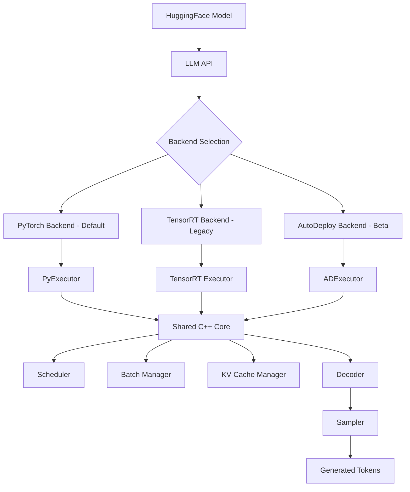

TensorRT-LLM is designed with a layered architecture that combines a Python API frontend with highly optimized execution backends. This design enables both ease of use and maximum performance for LLM inference on NVIDIA GPUs.

## High-Level Architecture

The system follows a three-layer architecture:



<Note>
The **PyTorch backend** is the default and recommended backend for most use cases. It provides the best balance of performance and flexibility.
</Note>

## Core Components

TensorRT-LLM's architecture is built around several key components that work together to deliver high-performance inference:

### LLM API (Entry Point)

The `LLM` class in `tensorrt_llm/llmapi/llm.py` serves as the main entry point for users:

```python
from tensorrt_llm import LLM

# Initialize with any HuggingFace model
llm = LLM(model="TinyLlama/TinyLlama-1.1B-Chat-v1.0")

# Generate text
output = llm.generate("Hello, my name is")
```

The LLM API automatically handles:
- **Tokenization**: Converting input text to token IDs
- **Detokenization**: Converting output token IDs back to text
- **Backend selection**: Choosing the appropriate execution backend
- **Model loading**: Loading model weights and configuration

### Executor Layer

The executor layer is responsible for managing the execution of inference requests. Different backends use different executors:

<AccordionGroup>
  <Accordion title="PyExecutor (PyTorch Backend)" icon="python">
    The `PyExecutor` creates a dedicated worker process on each GPU rank and operates in a continuous background loop to process inference requests asynchronously.

    **Location**: `tensorrt_llm/_torch/pyexecutor/py_executor.py`

    **Key responsibilities**:
    - Fetches new inference requests from the request queue
    - Schedules requests for execution
    - Manages model forward passes
    - Coordinates with the decoder for token generation
  </Accordion>

  <Accordion title="TensorRT Executor (Legacy)" icon="microchip">
    The TensorRT backend uses compiled TensorRT engines for maximum performance. This is the legacy backend, maintained for backward compatibility.

    **Entry point**: `LLM(backend="tensorrt")`

    **Path**: `builder.py` → `trtllm.Executor` → TensorRT Engine
  </Accordion>

  <Accordion title="ADExecutor (AutoDeploy - Beta)" icon="wand-magic-sparkles">
    AutoDeploy automatically converts PyTorch/HuggingFace models to optimized TensorRT-LLM inference graphs through automated graph transformations.

    **Entry point**: `LLM(backend="_autodeploy")`

    **Path**: `_torch/auto_deploy/` → `ADExecutor` → graph transforms + torch.export
  </Accordion>
</AccordionGroup>

### Shared C++ Core

All backends share highly optimized C++ components (exposed via Nanobind bindings) for critical runtime operations:

<CardGroup cols={2}>
  <Card title="Scheduling Pipeline" icon="arrows-turn-to-dots">
    - **Scheduler**: Determines which requests can be executed
    - **Batch Manager**: Implements in-flight batching (continuous batching)
    - **KV Cache Manager**: Allocates and manages key-value cache blocks
  </Card>

  <Card title="Decoding Pipeline" icon="microchip">
    - **Decoder**: Orchestrates token generation
    - **Sampler**: Applies sampling strategies (greedy, top-k, top-p, beam search)
  </Card>
</CardGroup>

## Request Flow

Understanding how a request flows through the system helps clarify the role of each component:

```
┌─────────────────────────────────────────────────────────────────┐
│ 1. User submits prompt to LLM API                               │
└──────────────────────────┬──────────────────────────────────────┘
                           ▼
┌─────────────────────────────────────────────────────────────────┐
│ 2. Tokenization (text → token IDs)                              │
└──────────────────────────┬──────────────────────────────────────┘
                           ▼
┌─────────────────────────────────────────────────────────────────┐
│ 3. Executor receives request                                     │
│    (PyExecutor / TensorRT Executor / ADExecutor)                │
└──────────────────────────┬──────────────────────────────────────┘
                           ▼
┌─────────────────────────────────────────────────────────────────┐
│ 4. Scheduler decides when to process request                    │
│    - Checks available KV cache blocks                           │
│    - Applies max_batch_size and max_num_tokens limits           │
└──────────────────────────┬──────────────────────────────────────┘
                           ▼
┌─────────────────────────────────────────────────────────────────┐
│ 5. Model Forward Pass                                            │
│    - Context phase: Process all prompt tokens                   │
│    - Generation phase: Process one token per step               │
└──────────────────────────┬──────────────────────────────────────┘
                           ▼
┌─────────────────────────────────────────────────────────────────┐
│ 6. Decoder generates next token                                  │
│    - Receives logits from model                                 │
│    - Sampler applies sampling strategy                          │
└──────────────────────────┬──────────────────────────────────────┘
                           ▼
┌─────────────────────────────────────────────────────────────────┐
│ 7. Update state and check completion                            │
│    - Add token to KV cache                                      │
│    - Check stop criteria (EOS, max_length)                      │
│    - Return to step 4 if not finished                           │
└──────────────────────────┬──────────────────────────────────────┘
                           ▼
┌─────────────────────────────────────────────────────────────────┐
│ 8. Detokenization (token IDs → text)                            │
└──────────────────────────┬──────────────────────────────────────┘
                           ▼
┌─────────────────────────────────────────────────────────────────┐
│ 9. Return result to user                                         │
└─────────────────────────────────────────────────────────────────┘
```

### PyExecutor Iteration Loop

The PyExecutor operates in a continuous loop, processing batches of requests:

```python
# Simplified PyExecutor iteration (from py_executor.py)
while not done:
    # 1. Fetch new requests from queue
    new_requests = request_queue.get_new_requests()
    
    # 2. Schedule requests for this step
    scheduled_batch = scheduler.schedule(
        active_requests=active_requests,
        available_kv_blocks=kv_cache_manager.available_blocks()
    )
    
    # 3. Prepare KV cache resources
    kv_cache_manager.prepare_resources(scheduled_batch)
    
    # 4. Run model forward pass
    logits = model_engine.forward(scheduled_batch)
    
    # 5. Sample next tokens
    next_tokens = sampler.sample(logits, scheduled_batch)
    
    # 6. Update requests and check completion
    for request in scheduled_batch:
        request.add_token(next_tokens[request.id])
        if request.is_finished():
            return_to_user(request)
            active_requests.remove(request)
            kv_cache_manager.free_resources(request)
```

<Info>
The **Overlap Scheduler** optimization allows CPU tasks (like checking stop criteria) to run concurrently with GPU computation, maximizing throughput. See [Optimization Techniques](/concepts/optimization-techniques) for details.
</Info>

## Key Configuration Files

Understanding the main source files helps navigate the codebase:

| File | Purpose |
|------|--------|
| `tensorrt_llm/llmapi/llm.py` | Main LLM API entry point |
| `tensorrt_llm/llmapi/llm_args.py` | Complete configuration schema (Pydantic-based) |
| `tensorrt_llm/llmapi/llm_utils.py` | Model loading and model-specific defaults |
| `tensorrt_llm/_torch/pyexecutor/py_executor.py` | PyExecutor implementation |
| `tensorrt_llm/_torch/pyexecutor/scheduler/scheduler.py` | Request scheduler |
| `tensorrt_llm/_torch/pyexecutor/resource_manager.py` | KV cache and resource management |
| `tensorrt_llm/_torch/pyexecutor/model_engine.py` | Model forward pass execution |
| `tensorrt_llm/_torch/pyexecutor/sampler.py` | Token sampling logic |

## Model Architecture Pattern

All models in TensorRT-LLM follow a consistent pattern:

<Steps>
  <Step title="Config Class">
    Each model has a `Config` class that inherits from `PretrainedConfig`
    
    **Example**: `LlamaConfig` in `tensorrt_llm/models/llama/config.py`
  </Step>

  <Step title="ForCausalLM Class">
    Each model implements a `ForCausalLM` class (e.g., `LlamaForCausalLM`) that inherits from `PretrainedModel`
    
    This class contains the actual model implementation
  </Step>

  <Step title="Auto-Registration">
    Models self-register via `automodel.py` for automatic discovery
    
    The system uses the HuggingFace config's `architectures` field to find the right model
  </Step>
</Steps>

## Distributed Execution

TensorRT-LLM supports distributed inference across multiple GPUs:

- **Tensor Parallelism**: Split individual layers across GPUs
- **Pipeline Parallelism**: Distribute layers across GPUs  
- **Communication Backends**: MPI, Ray, or RPC
- **Mapping Class**: The `Mapping` class in `tensorrt_llm/mapping.py` handles the distribution strategy

## Serving Architecture

For production deployments, TensorRT-LLM provides `trtllm-serve`:

- **OpenAI-compatible** REST + gRPC server
- Supports all backends (PyTorch, TensorRT, AutoDeploy)
- **Disaggregated serving**: Separates prefill (context processing) and decode (generation) across different GPU pools
  - KV cache exchange via NIXL (default), UCX, or MPI
  - Optimizes resource utilization for different workload characteristics

<CardGroup cols={2}>
  <Card title="Backend Selection" icon="shuffle" href="/concepts/backends">
    Learn when to use PyTorch, TensorRT, or AutoDeploy backends
  </Card>

  <Card title="Optimization Techniques" icon="gauge-high" href="/concepts/optimization-techniques">
    Explore in-flight batching, paged KV cache, and CUDA graphs
  </Card>
</CardGroup>
