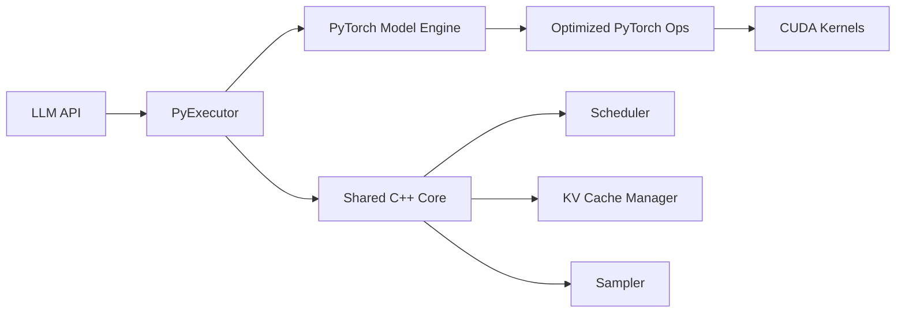
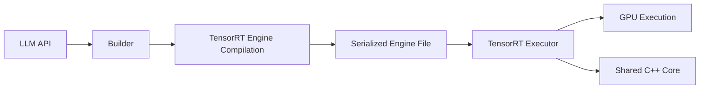
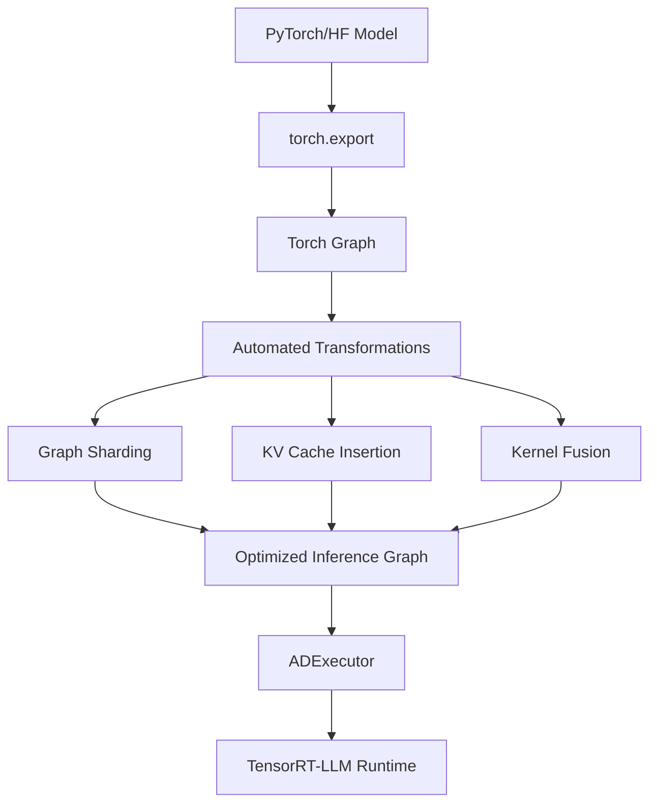

TensorRT-LLM supports three execution backends, each optimized for different use cases and deployment scenarios. This guide helps you choose the right backend for your needs.

## Backend Comparison

<CardGroup cols={3}>
  <Card title="PyTorch" icon="python" color="#ee4c2c">
    **Default** - Recommended for most users
    
    Best balance of performance and flexibility
  </Card>

  <Card title="TensorRT" icon="microchip" color="#76b900">
    **Legacy** - Maintained for compatibility
    
    Compiled TensorRT engines
  </Card>

  <Card title="AutoDeploy" icon="wand-magic-sparkles" color="#6366f1">
    **Beta** - Experimental
    
    Automatic model optimization
  </Card>
</CardGroup>

## Backend Overview Table

| Feature | PyTorch | TensorRT | AutoDeploy |
|---------|---------|----------|------------|
| **Status** | Default ✅ | Legacy | Beta (experimental) |
| **Entry Point** | `LLM(backend="pytorch")` | `LLM(backend="tensorrt")` | `LLM(backend="_autodeploy")` |
| **Key Path** | `_torch/pyexecutor/` → `PyExecutor` | `builder.py` → `trtllm.Executor` | `_torch/auto_deploy/` → `ADExecutor` |
| **Performance** | Excellent | Maximum | Good (improving) |
| **Flexibility** | High | Low | Very High |
| **Build Time** | None (dynamic) | Long (compilation) | Medium (graph transforms) |
| **New Model Support** | Requires implementation | Requires implementation | Day-0 support |
| **Recommended For** | Production, development | Legacy workloads | Prototyping, new models |

---

## PyTorch Backend (Default)

The PyTorch backend is the **default and recommended backend** for TensorRT-LLM. It combines excellent performance with maximum flexibility.

### Architecture



### Key Features

<AccordionGroup>
  <Accordion title="Dynamic Execution" icon="bolt">
    - No compilation step required
    - Immediate model loading and inference
    - Easy debugging with standard PyTorch tools
    - Supports `torch.compile` for additional optimization
  </Accordion>

  <Accordion title="Custom Attention Kernels" icon="microchip">
    The PyTorch backend uses highly optimized custom attention implementations:

    - **TrtllmAttention** (default): Hand-tuned CUDA kernels for maximum performance
    - **FlashInferAttention**: Alternative backend with FP8 quantization support
    - **VanillaAttention**: Reference implementation for testing

    Specify via: `LLM(attn_backend="trtllm")` or `LLM(attn_backend="flashinfer")`
  </Accordion>

  <Accordion title="Full Feature Support" icon="list-check">
    - In-flight batching (continuous batching)
    - Paged KV cache with cross-request reuse
    - Speculative decoding (EAGLE, Medusa, n-gram, etc.)
    - LoRA adapters with dynamic switching
    - Multi-modal models (vision-language)
    - Quantization (FP8, INT8, INT4)
    - CUDA Graphs
    - Overlap scheduler
  </Accordion>

  <Accordion title="Distributed Inference" icon="network-wired">
    - Tensor parallelism
    - Pipeline parallelism
    - Multiple communication backends (MPI, Ray, RPC)
    - Disaggregated serving (separate prefill and decode)
  </Accordion>
</AccordionGroup>

### When to Use PyTorch Backend

<Check>**Use the PyTorch backend when:**</Check>

- Starting a new project (it's the default)
- You need rapid iteration and development
- You want the latest features and optimizations
- You need to debug model behavior
- You're deploying to production (recommended)

### Example Usage

```python
from tensorrt_llm import LLM

# PyTorch backend is the default
llm = LLM(
    model="meta-llama/Llama-3.2-1B",
    backend="pytorch",  # Optional, this is the default
    attn_backend="trtllm",  # Use optimized TRT-LLM attention kernels
)

output = llm.generate("Explain quantum computing")
```

<Info>
**Source Location**: All PyTorch backend code is in `tensorrt_llm/_torch/`

Key files:
- `_torch/pyexecutor/py_executor.py` - Main executor
- `_torch/pyexecutor/model_engine.py` - Model execution
- `_torch/attention_backend/` - Attention implementations
</Info>

---

## TensorRT Backend (Legacy)

The TensorRT backend uses compiled TensorRT engines for inference. This backend is considered **legacy** and is maintained primarily for backward compatibility.

### Architecture



### Key Characteristics

<Warning>
The TensorRT backend requires a **compilation step** that can take 30+ minutes for large models. This compiled engine is hardware-specific and cannot be transferred between different GPU architectures.
</Warning>

**Advantages:**
- Maximum theoretical performance through aggressive optimization
- Highly optimized kernel fusion
- Efficient memory usage

**Disadvantages:**
- Long build times (30+ minutes for large models)
- Hardware-specific engines (cannot transfer between GPU types)
- Limited flexibility (cannot modify model after compilation)
- Slower to adopt new features
- Difficult to debug

### When to Use TensorRT Backend

<Check>**Use the TensorRT backend only when:**</Check>

- You have an existing deployment using TensorRT engines
- You need to maintain backward compatibility
- You have very specific performance requirements that PyTorch backend doesn't meet

<Warning>
For new projects, NVIDIA recommends using the **PyTorch backend** instead. It provides comparable performance without the compilation overhead.
</Warning>

### Example Usage

```python
from tensorrt_llm import LLM

# TensorRT backend (legacy)
llm = LLM(
    model="meta-llama/Llama-3.2-1B",
    backend="tensorrt",
)

output = llm.generate("Explain quantum computing")
```

---

## AutoDeploy Backend (Beta)

AutoDeploy is an **experimental backend** that automatically optimizes PyTorch/HuggingFace models for inference through automated graph transformations. It requires **no manual model implementation**.

<Note>
**Status**: Beta - Under active development. The API may change in future releases.
</Note>

### Architecture



### Key Features

<CardGroup cols={2}>
  <Card title="Zero Code Changes" icon="magic">
    Works with unmodified PyTorch/HuggingFace models
    
    No manual kernel implementation required
  </Card>

  <Card title="Day-0 Model Support" icon="rocket">
    Support new model architectures immediately
    
    Great for prototyping and experimentation
  </Card>

  <Card title="Automated Optimization" icon="wand-sparkles">
    Automatic graph transformations:
    - Sharding for multi-GPU
    - KV cache integration
    - Attention fusion
    - Quantization
    - CUDA Graph optimization
  </Card>

  <Card title="Single Source of Truth" icon="file-code">
    Maintain your original PyTorch model
    
    No need for separate inference implementations
  </Card>
</CardGroup>

### Workflow

<Steps>
  <Step title="Model Export">
    AutoDeploy uses `torch.export` to capture the computation graph from your PyTorch model
  </Step>

  <Step title="Graph Transformation">
    Applies automated transformations:
    - Graph sharding for tensor parallelism
    - KV cache block insertion
    - GEMM fusion
    - Custom attention operator replacement
  </Step>

  <Step title="Compilation">
    Compiles the optimized graph using torch compilation backends (e.g., `torch-opt`)
  </Step>

  <Step title="Runtime Execution">
    Deploys to TensorRT-LLM runtime with all standard optimizations (in-flight batching, paging, overlap scheduling)
  </Step>
</Steps>

### When to Use AutoDeploy Backend

<Check>**Use the AutoDeploy backend when:**</Check>

- You're working with a new model architecture not yet supported in TensorRT-LLM
- You need rapid prototyping and experimentation
- You want to deploy a custom PyTorch model without manual optimization
- You're evaluating whether to invest in a full TensorRT-LLM implementation

<Warning>
**Limitations** (Beta):
- Performance may be lower than hand-optimized PyTorch backend
- Limited feature support (e.g., no LoRA, no speculative decoding yet)
- API subject to change
- Not recommended for production workloads
</Warning>

### Example Usage

```python
from tensorrt_llm import LLM

# AutoDeploy backend (beta)
llm = LLM(
    model="meta-llama/Llama-3.2-1B",
    backend="_autodeploy",  # Note the underscore prefix
)

output = llm.generate("Explain quantum computing")
```

### Example: Custom Model

```python
import torch
from transformers import AutoModelForCausalLM
from tensorrt_llm import LLM

# Load your custom PyTorch model
model = AutoModelForCausalLM.from_pretrained("your-org/custom-model")

# AutoDeploy automatically optimizes it
llm = LLM(
    model=model,  # Pass PyTorch model directly
    backend="_autodeploy",
)

output = llm.generate("Hello world")
```

<Info>
**Source Location**: AutoDeploy code is in `tensorrt_llm/_torch/auto_deploy/`

**Roadmap**:
- Vision-Language Models (VLMs)
- State Space Models (SSMs)
- LoRA support
- Speculative decoding

Track progress: [GitHub Project Board](https://github.com/orgs/NVIDIA/projects/83/views/13)
</Info>

---

## Choosing the Right Backend

<CardGroup cols={1}>
  <Card title="Decision Flow" icon="sitemap">
    ```
    Are you starting a new project?
      YES → Use PyTorch Backend ✅
      NO ↓
    
    Do you have existing TensorRT engines?
      YES → Continue with TensorRT Backend (Legacy)
      NO ↓
    
    Do you need to deploy a custom/unsupported model quickly?
      YES → Try AutoDeploy Backend (Beta) 🧪
      NO → Use PyTorch Backend ✅
    ```
  </Card>
</CardGroup>

## Performance Comparison

<Note>
In most cases, the **PyTorch backend** provides performance within 5-10% of the TensorRT backend, without any compilation overhead. For many workloads, especially with CUDA Graphs enabled, the PyTorch backend matches or exceeds TensorRT backend performance.
</Note>

### Benchmark Example (Llama-2-7B on H100)

| Backend | Throughput (tokens/s) | Build Time | Flexibility |
|---------|----------------------|------------|-------------|
| **PyTorch** | 12,500 | None | High |
| **TensorRT** | 13,000 | 45 min | Low |
| **AutoDeploy** | 10,000 | 5 min | Very High |

<Info>
Actual performance depends on many factors: model architecture, batch size, sequence length, hardware, and configuration parameters. Always benchmark with your specific workload.
</Info>

## Shared Features Across All Backends

All three backends benefit from the **Shared C++ Core** components:

- **Scheduler**: In-flight batching and request scheduling
- **KV Cache Manager**: Paged memory management with cross-request reuse
- **Batch Manager**: Dynamic batching optimization
- **Decoder**: Token generation orchestration
- **Sampler**: Sampling strategies (greedy, top-k, top-p, beam search)

These components ensure consistent behavior and performance optimizations regardless of which backend you choose.

<CardGroup cols={2}>
  <Card title="System Architecture" icon="sitemap" href="/concepts/architecture">
    Learn about the overall system design
  </Card>

  <Card title="Optimization Techniques" icon="gauge-high" href="/concepts/optimization-techniques">
    Explore advanced performance optimizations
  </Card>
</CardGroup>
